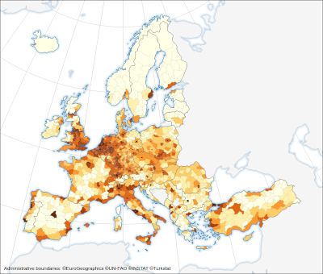
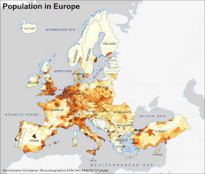

# Eurostat-map in 5 minutes

This page describes how to quickly create a statistical map with Eurostat data. It does not require any knowledge in javascript programming.

## Create a map

- Download [**eurostat_map.html**](https://raw.githubusercontent.com/eurostat/eurostat-map.js/master/docs/tutos/quick/eurostat_map.html) file.
- Double click on it: This map should appear in a web browser:



This is a default map showing the latest Eurostat figures on population.

## First customisation

To modify this map, edit the **eurostat_map.html** file with a text editor such as Notepad or [Notepad++](https://notepad-plus-plus.org/). For that, you can either:
   - right-click on the file, select "open with..." menu item, and select a text edition program,
   - or launch a text editor and open the file

You should see the short code snippet defining the map:

```html
<svg id="map"></svg>
<script src="https://unpkg.com/eurostat-map@3.3.0"></script>
<script>
eurostatmap.map("ch")
.build();
</script>
``` 

As first modifications, we propose to:
- add a title: *Population in Europe*,
- change the background color in light gray,
- show place name labels.

This can be achieved by simply inserting the three lines below:

```html
<svg id="map"></svg>
<script src="https://unpkg.com/eurostat-map@3.3.0"></script>
<script>
eurostatmap.map("ch")
   .title("Population in Europe")
   .seaFillStyle("lightgray")
   .labelling(true)
.build();
</script>
```

To show the modified map,
1. save the file (CTRL+S),
2. re-open it (with double-click), or fresh the web browser content by pressing F5 button.

The new map appears:



For each map characteristic to change, insert a line with the **name** of the characteristic (such as ```.title```) and the desired **value** (such ```"Population in Europe"```).

List of caracteristics is described in the [API reference](../../reference.md).

The most important characteristic is of course the statistical data to show on the map, as described in the next section.

### Choose the statistics

TODO: explain how to find data from Eurostat data. +CSV case

Get code of the database
https://ec.europa.eu/eurostat/web/main/data/database
example

Use query builder
https://ec.europa.eu/eurostat/web/json-and-unicode-web-services/getting-started/query-builder

get url
transform into:


CSV case ?


## More customisation

- Describe how to go through the documentation

Different types of maps.

## Publish the map
- Explain how to insert the code snippet in a CMS


Use ``<script src="https://unpkg.com/eurostat-map@X.Y.Z"></script>``, where *X.Y.Z* is a version number among [these ones](https://www.npmjs.com/package/eurostat-map?activeTab=versions).
